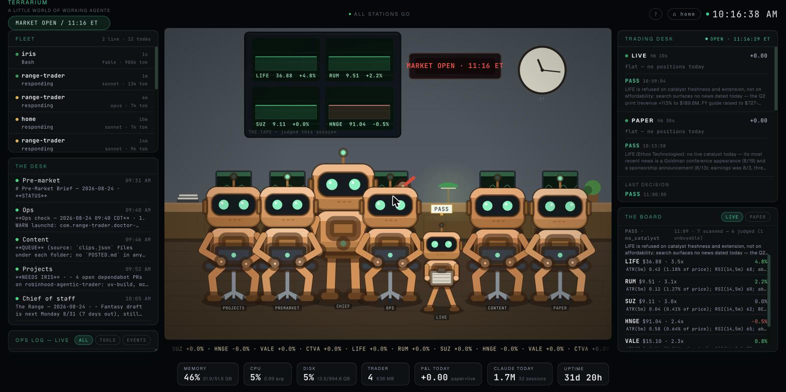
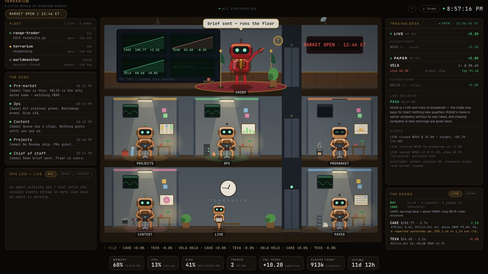
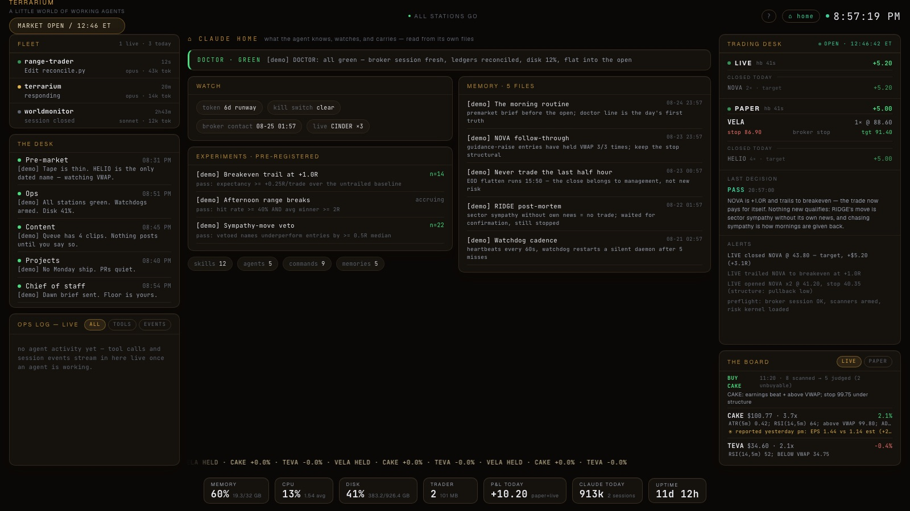

# TERRARIUM

**A little world of working agents.**



*Night watch, for real: the building sleeps because the agents do. One office
is still lit — that seat worked in the last twenty minutes. The chief holds
the executive floor, the LED sign reads the actual session clock, and the
big board charts the names the trading engine really judged today.*

## What am I looking at?

Terrarium is a local-first mission control for the AI agents running on one
machine, drawn as a three-story office building — entirely in code, no image
assets. Every robot is a real scheduled seat or trading book. Every light,
chart, sign, and speech bubble is live telemetry: an office lights up when
its agent worked in the last twenty minutes and goes dark when it's off
shift. The rails around the building carry the raw feeds — sessions, seats,
both trading books, an ops log, machine vitals. Everything on screen is real
(except demo mode, which says so on every line).

## Try it in 60 seconds — no accounts, no config

```bash
git clone https://github.com/Iraizeye/terrarium && cd terrarium
make demo        # -> http://127.0.0.1:3000
```



*Demo mode at its market open: offices lit because their seats "just ran",
premarket already off shift, a scripted book working a position.*

Demo mode (`TERRARIUM_DEMO=1`) runs every panel on a **scripted synthetic
day** — a fictional trader working NOVA, RIDGE and CINDER through entries,
breakeven trails, a stop-out and a target, while scripted agent sessions
fill the fleet and the desk. A compressed 24h session loops every 5 minutes,
so you see the building wake up, trade the open, and go dark for the night
without waiting for New York. Every line is fiction and labeled `[demo]`;
nothing on your machine is read.

First visit, an intro overlay explains the four zones; reopen it any time
with the `?` button in the header. Useful URL params: `?phase=night|dawn|day|dusk`
previews the room lighting, `?view=home` deep-links the agent's home page,
`?intro=0` skips the overlay (kiosk displays).

## How to read the building (the company chart, drawn)

- **3F — Chief / Vesper HQ** — the chief of staff. Bubble = the morning
  brief when it's in, else the latest Strategy verdict. Lights only when
  the chief itself ran — never because someone downstairs was busy.
- **2F — Strategy & Build** — the on-call departments, with the desk
  annexes (ops, projects) across the shaft. **Lamps are artifact-driven:**
  Strategy lights when an RFC file changed in the last 20 minutes; Build
  lights when a commit landed in a hub repo. Talk lights nothing.
- **1F — the TRADING PIT** — the ground-floor plant: live + paper
  terminals side by side, the premarket briefing desk, and the INTERLOCK
  breaker (green = armed & watched, red = KILL) drawn from real
  kill-switch + watchdog telemetry. Display only — this dashboard has no
  trading controls. The live robot patrols the lobby on a fresh
  heartbeat; the content annex keeps its studio; the wall clock reads ET.
- **The big board** — charts the symbols the trading engine judged this
  session, drawn from its real decision log.
- **The LED sign** — the real market session clock (pre-market, open,
  after hours, night watch).
- **The tape** — under the building: what the engine saw last cycle.
  `PASS` means it judged a candidate and declined, with the thesis verbatim
  in the right rail.

## What it watches

- **The agents** — live activity via Claude Code hooks: every session, tool
  call, and finished turn lands on the stage in ~2s, plus a token/usage strip
  parsed incrementally from local transcripts (nothing leaves the machine)
- **The trader** — [an autonomous trading agent's](https://github.com/Iraizeye/robinhood-agentic-trader)
  paper + live daemons: heartbeat freshness, watchdog arming, kill-switch
  state, open positions with stop/target, realized P&L today, the engine's
  last decision and thesis, and a live alerts tail
- **The machine** — CPU / RAM / disk / uptime, the trading daemons' footprint,
  and TCP checks on the services that still exist

Health checks run over the *real* stack — daemons, watchdogs, heartbeats,
kill switch, disk — and feed the header status bar. Red means something is
actually wrong; a healthy machine reads **ALL STATIONS GO**.

## The agent's home page

The `⌂ home` button (or `?view=home`) flips the stage to the agent's own
page: the morning doctor line, standing watch items (auth runway, kill
switch, open positions), the pre-registered experiment board with its pass
bars, and the agent's persistent memory shelf — titles and hooks read
straight from its own files, so the page can never drift from the truth.



## The Claude Code plugin

This repo is also a plugin marketplace. With the dashboard running, wire any
Claude Code session into the building in two commands:

```
/plugin marketplace add Iraizeye/terrarium
/plugin install terrarium@terrarium
```

Hooks stream your sessions onto the floor (tool names and file basenames
only, localhost only), and you get `/terrarium:status` and
`/terrarium:note`. Details in [plugin/README.md](plugin/README.md).

## Architecture

```
backend/   FastAPI :8000 — read-only collectors, WebSocket push
frontend/  React + Vite :3000 — canvas building, trading desk, ops log
```

Two API contracts are **frozen** (external hooks depend on them):

- `POST /api/crew/hook` — Claude Code hook receiver (`~/.claude/settings.json`)
- `POST /api/sessions/log` — session/alert log (the trading agent's alert hook)

Everything the backend watches, it watches read-only: ledgers open in SQLite
ro-mode, transcripts and logs are tail-read from byte offsets, and the only
thing it ever writes is its own session-log DB.

## Run it for real

```bash
make dev         # backend :8000 + frontend :3000 against YOUR machine
```

Point it at your own stack with env vars (all optional — a panel with
nothing to watch renders quietly instead of breaking):

| Env | Watches | Default |
|---|---|---|
| `RANGE_TRADER_DIR` | trader heartbeats, ledgers, alerts | `~/.range-trader` |
| `CLAUDE_PROJECTS_DIR` | Claude Code transcripts (token usage) | `~/.claude/projects` |
| `TERRARIUM_SESSIONS_DB` | session-log SQLite | `~/.claude/atlas-sessions.db` |

Everything binds to localhost only. This is a local-first, host-path-bound
tool by design — it reads local state directly, so there is deliberately no
hosted version.

## Tests

```bash
make test     # backend suite + lint (ruff, biome, tsc, knip)
make visual   # the look itself: golden screenshots at 3 window sizes
```

The backend suite covers the market clock (including weekend rollover), the
trading collector against fixture ledgers, incremental usage parsing,
demo-mode shape parity, and both frozen contracts. The visual suite renders
the building and home page against a frozen, fully scripted demo instant
and diffs the pixels — layout drift fails the build. After an intentional
look change, re-approve with `make visual-update` and commit the goldens.
