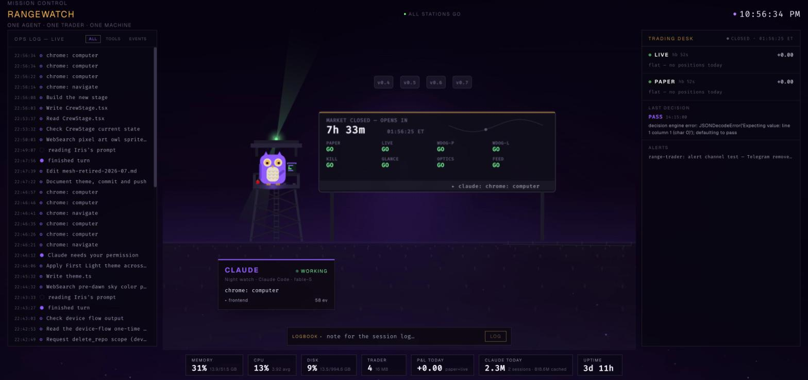

# RANGEWATCH

**Mission control for one agent, one trader, one machine.**



A local-first dashboard that watches the three things that matter on this box:

- **Claude** — live activity via Claude Code hooks: every session, tool call,
  and finished turn lands on the stage in ~2s, plus a token/usage strip parsed
  incrementally from local transcripts (ccusage-style, nothing leaves the Mac)
- **The trader** — [range-trader](https://github.com/iriseye931-ai/robinhood-agentic-trader)
  paper + live daemons: heartbeat freshness, watchdog arming, kill-switch
  state, open positions with stop/target, realized P&L today, the engine's
  last decision and thesis, and a live alerts tail
- **The machine** — CPU / RAM / disk / uptime, the trading daemons' footprint,
  and TCP checks on the services that still exist

**The sky lives the trading day** — the FIRST LIGHT theme. Violet is the
agent's color; gold is the market's. Deep pre-dawn indigo while Claude works
the night, an amber glow climbing the horizon in the 90 minutes before the
open, a golden horizon under the range while the market trades, and an ember
fade after the close. Preview any phase with `?phase=night|dawn|day|dusk`.

The centerpiece is a flight-control **big board**: a market clock counting down to
the next open/close, and a GO/NO-GO grid over the *real* stack — PAPER, LIVE,
WDOG-P, WDOG-L, KILL, GLANCE, OPTICS, FEED. Red means something is actually
wrong; a healthy machine reads **ALL STATIONS GO**.

Claude is **the watch-owl**: a violet owl with golden iris eyes, perched in a
watchtower over the range. The eyes track what it's doing, the head cocks when
it thinks, a wing works the console when it's busy — and the tower's **beacon
sweeps the sky in Claude's status color**, readable from across the room.
Finished turns get a burst of first-light sparks, because dashboards are
allowed to be fun. Click the tower and it waves.

## Architecture

```
backend/   FastAPI :8000 — 5 modules, read-only collectors, WebSocket push
frontend/  React + Vite :3000 — canvas stage, trading desk, ops log
```

Two API contracts are **frozen** (external hooks depend on them):

- `POST /api/crew/hook` — Claude Code hook receiver (`~/.claude/settings.json`)
- `POST /api/sessions/log` — session/alert log (`range-trader`'s alert hook)

Everything the backend watches, it watches read-only: ledgers open in SQLite
ro-mode, transcripts and logs are tail-read from byte offsets, and the only
thing it ever writes is its own session-log DB.

## Run it

```bash
# backend
cd backend && python -m venv venv && venv/bin/pip install -r requirements.txt
./run_mission_control.sh          # uvicorn on 127.0.0.1:8000

# frontend
cd frontend && npm install && npm run dev   # vite on :3000
```

Both run under launchd on the owner's machine (`local.mcd-backend`,
`local.mcd-frontend`) and bind to localhost only. This is a local-first,
host-path-bound tool by design — it reads `~/.range-trader` and
`~/.claude/projects` directly, so there is deliberately no Docker setup.

## Tests

```bash
backend/venv/bin/python -m pytest backend/tests/
```

Covers the market clock (including weekend rollover), the trading collector
against fixture ledgers, incremental usage parsing, and both frozen contracts.

