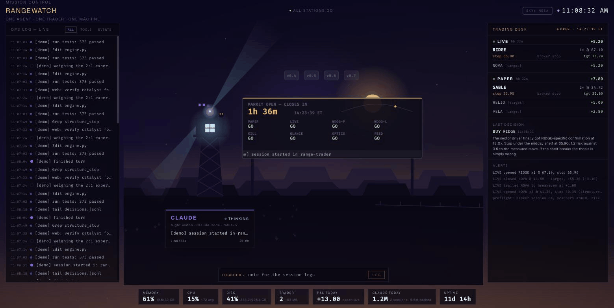
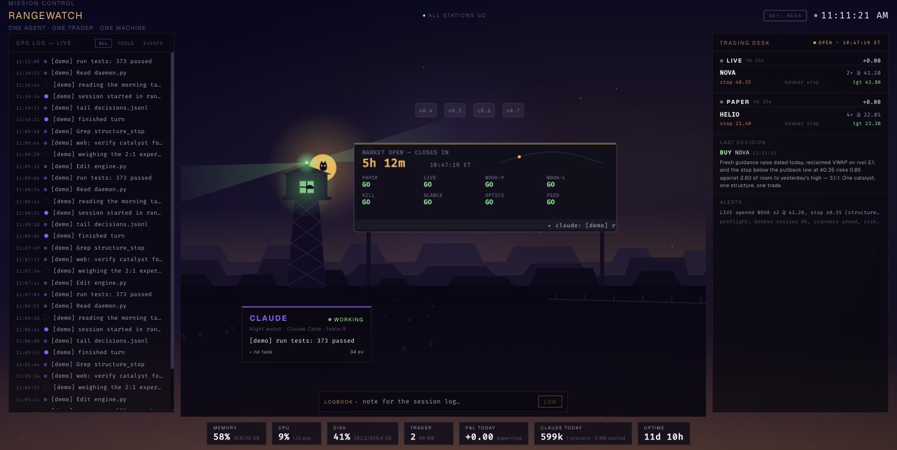
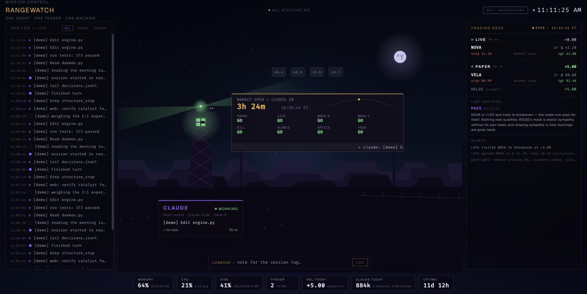
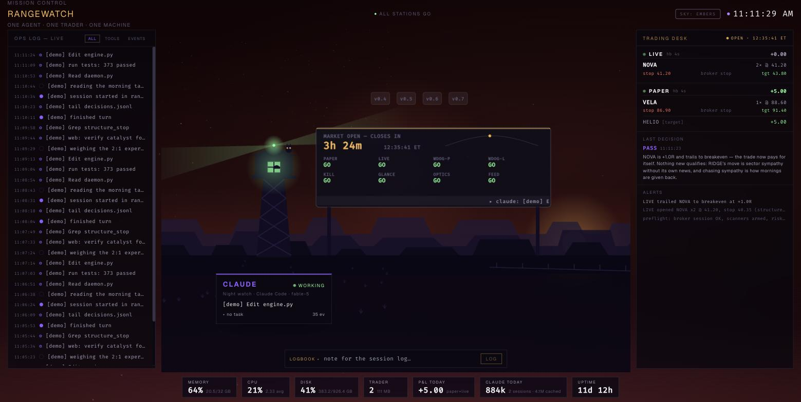

# TERRARIUM

**Your AI agents, under glass.**



*The sun is the market. It rises for the open, arcs while the session runs,
and sets after the close; nights get a cratered moon. The watchtower is
your lead agent — lit window, sweeping beacon, an owl on the roof. Above:
demo mode compressing a full trading day into five minutes.*

## What am I looking at?

Terrarium is a local-first mission control for the AI agents running on one
machine. Every agent session is a figure on the floor; the sky lives the
real market day; the rails carry live telemetry — sessions, scheduled
seats, both trading books, an ops log, machine vitals. Everything on screen
is real (except demo mode, which says so on every line).

## Try it in 60 seconds — no accounts, no config

```bash
git clone https://github.com/Iraizeye/terrarium && cd terrarium
make demo        # -> http://127.0.0.1:3000
```

Demo mode (`TERRARIUM_DEMO=1`) runs every panel on a **scripted synthetic
day** — a fictional trader working NOVA, RIDGE and CINDER through entries,
breakeven trails, a stop-out and a target, while a scripted agent works the
watchtower. A compressed 24h session loops every 5 minutes so you see dawn,
the open, the close and the stars without waiting for New York. Every line
is fiction and labeled `[demo]`; nothing on your machine is read.

First visit, an intro overlay walks you through the four zones; reopen it
any time with the `?` button in the header.

## Skies

Three themes, same glass. Cycle with the `SKY:` button in the header, pin
one with `?theme=mesa|observatory|embers`, preview any hour with
`?phase=night|dawn|day|dusk`.

| MESA *(flagship)* | OBSERVATORY | EMBERS |
|---|---|---|
|  |  |  |
| First light — violet & gold | High-altitude steel & cyan | Fire watch — copper & coal |

A local-first dashboard that watches the three things that matter on the box:

- **The agents** — live activity via Claude Code hooks: every session, tool
  call, and finished turn lands on the stage in ~2s, plus a token/usage strip
  parsed incrementally from local transcripts (nothing leaves the machine)
- **The trader** — [an autonomous trading agent's](https://github.com/Iraizeye/robinhood-agentic-trader)
  paper + live daemons: heartbeat freshness, watchdog arming, kill-switch
  state, open positions with stop/target, realized P&L today, the engine's
  last decision and thesis, and a live alerts tail
- **The machine** — CPU / RAM / disk / uptime, the trading daemons' footprint,
  and TCP checks on the services that still exist

The centerpiece is a flight-control **big board**: a market clock counting down to
the next open/close, and a GO/NO-GO grid over the *real* stack. Red means
something is actually wrong; a healthy machine reads **ALL STATIONS GO**.

The stage is a silhouette landscape where the sun *is* the market: it climbs
toward the ridge as the open approaches, arcs across the sky while the
session runs, and sets after the close; off-hours get a cratered moon and
twinkling stars. The lead agent is the watchtower on the range — a lit
window and a sweeping beacon in status color, readable from across the room
— with a small owl silhouette on the roof, gold eyes blinking. A finished
turn sends a shooting star across the sky. Click the tower: the owl waves.

## Architecture

```
backend/   FastAPI :8000 — 5 modules, read-only collectors, WebSocket push
frontend/  React + Vite :3000 — canvas stage, trading desk, ops log
```

Two API contracts are **frozen** (external hooks depend on them):

- `POST /api/crew/hook` — Claude Code hook receiver (`~/.claude/settings.json`)
- `POST /api/sessions/log` — session/alert log (the trading agent's alert hook)

Everything the backend watches, it watches read-only: ledgers open in SQLite
ro-mode, transcripts and logs are tail-read from byte offsets, and the only
thing it ever writes is its own session-log DB.

## Run it for real

```bash
make dev         # backend :8000 + frontend :3000 against YOUR machine
```

Point it at your own stack with env vars (all optional — a panel with
nothing to watch renders quietly instead of breaking):

| Env | Watches | Default |
|---|---|---|
| `RANGE_TRADER_DIR` | trader heartbeats, ledgers, alerts | `~/.range-trader` |
| `CLAUDE_PROJECTS_DIR` | Claude Code transcripts (token usage) | `~/.claude/projects` |
| `TERRARIUM_SESSIONS_DB` | session-log SQLite | `~/.claude/atlas-sessions.db` |

`RANGEWATCH_*` env names from earlier releases still work.

Everything binds to localhost only. This is a local-first, host-path-bound
tool by design — it reads local state directly, so there is deliberately no
hosted version.

## Tests

```bash
make test
```

Covers the market clock (including weekend rollover), the trading collector
against fixture ledgers, incremental usage parsing, demo-mode shape parity,
and both frozen contracts.
